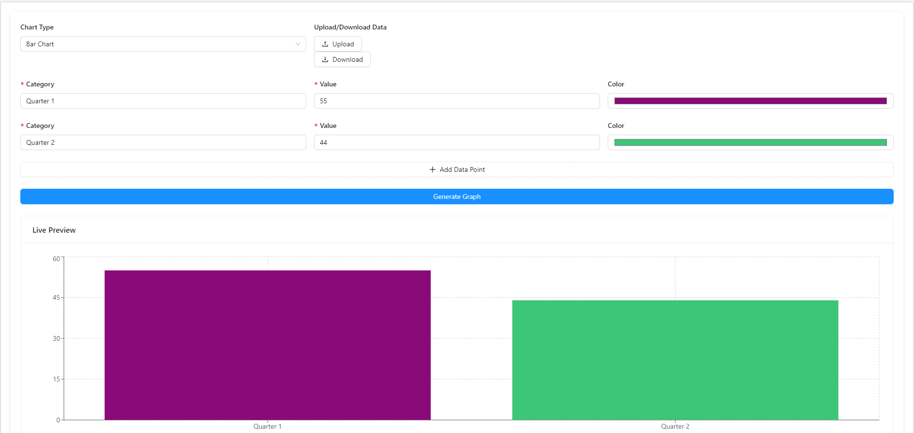
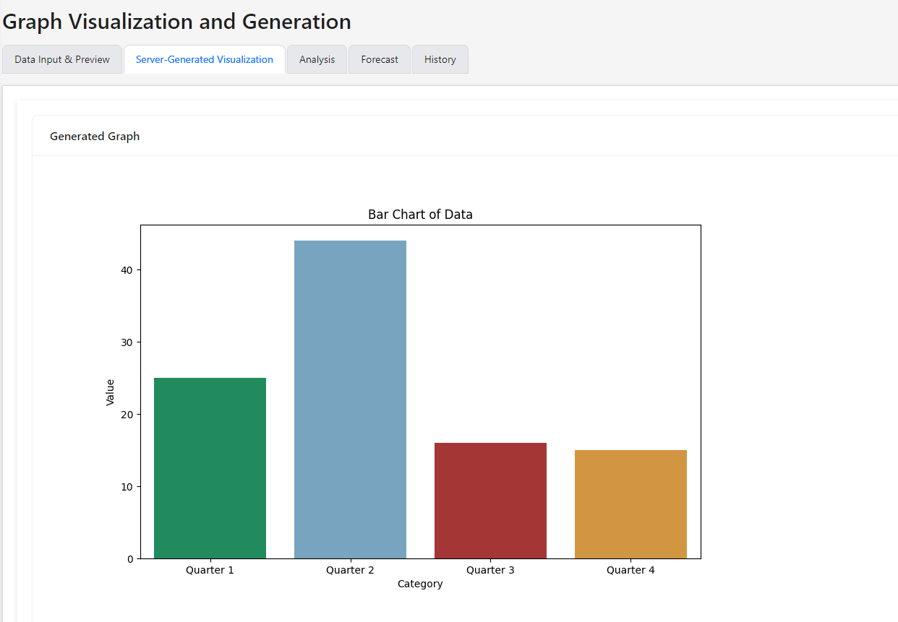
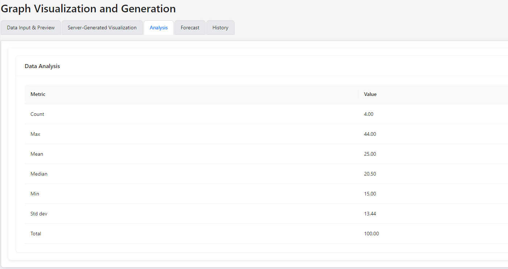

# Graph Visualization and Generation

## Purpose

This project can be used as a web application and is designed to help with basic visualizing, analysing and forecasting of data.

## Features

- Interactive data input with real-time chart preview
- Support for bar charts, line charts, and pie charts
- Customizable chart colors
- Server-generated visualizations that can be saved
- Basic statistical analysis of input data
- Simple forecasting based on input data
- Data history management for easy access to previous datasets

## Technologies Used

- Frontend:
  - React.js
  - Ant Design (UI components)
  - Recharts (for client-side charts)
  - Axios (for API requests)

- Backend:
  - Python
  - Flask (web framework)
  - Pandas (data manipulation)
  - Matplotlib (server-side chart generation)
  - Scikit-learn (for forecasting)

  ## Installation

1. Clone the repository:
    ```
    git clone https://github.com/KSoss/data-plot.git
    ```

2. Set up the backend:

    ```
    cd backend
    pip install flask flask-cors pandas matplotlib seaborn scikit-learn
    ```

    Create .env file in directory with the following info or your own preffered port information:

    ```
    FLASK_RUN_PORT=5050
    FLASK_ENV=production
    ```

    Then start the backend server:

    ```
    python data_dashboard.py
    ```

3. Set up the frontend:

    ```
    cd /frontend
    npm install
    ```

    Create .env file in directory with the following info or your own preffered port information:

    ```
    REACT_APP_API_URL=http://localhost:5050
    PORT=3000
    ```

    start the frontend development server:
    ```
    cd /frontend
    npm start
    ```

## How to Use

1. **Data Input**: 
   - Enter your data in the "Data Input & Preview" tab.
   - Add categories and values using the provided form.
   - Choose a chart type and customize colors as needed.
   - The live preview will update in real-time as you input data.

2. **Generate Visualization**:
   - After entering your data, click the "Generate Graph" button.
   - View the server-generated visualization in the "Server-Generated Visualization" tab.

3. **Analysis**:
   - "Analysis" tab to view basic statistical information about your data. Will only begin analysis if there are two or more pieces of data that have been used to generate a graph.

4. **Forecast**:
   - Check the "Forecast" tab to see a simple projection based on your input data.

5. **History**:
   - Use the "History" tab to view and load previous datasets. Data saved through localStorage.

## Screenshots





